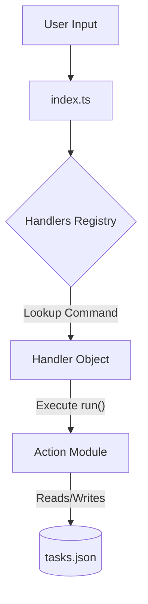

# Task Tracker CLI 📝

A Command Line Interface (CLI) application built with TypeScript and Node.js to manage daily tasks. This project demonstrates clean software design principles, using the local file system (`fs`) for data persistence, strict TypeScript typing, and modular architectures.

It is inspired by the backend developer project ideas from [roadmap.sh](https://roadmap.sh/projects/task-tracker).

---

## What I Learned & Key Takeaways

Building this project was a huge stepping stone for my backend and TypeScript skills. Key takeaways include:

* **Command Pattern & Extensibility:** Decoupling commands from the main application flow using a dynamic handlers mapping. This makes it trivial to add new features without changing the core CLI routing logic.
* **TypeScript Advanced Types:** Implementing utility types like `Record<string, Handler>` to model object dictionaries safely and maintain strict type checking across dynamic keys.
* **Consolidated Data Layer:** Merging individual reading and writing helper scripts into a single, clean `storage.ts` module with explicit inputs/outputs.
* **TypeScript Build Pipelines:** Configuring `tsconfig.json` with `"outDir": "./dist"` and `"rootDir": "./src"` to route compiled files to a clean target build directory, keeping source directories clean.
* **TypeScript Module Execution:** Overcoming Node's native ESM execution constraints (`ERR_UNKNOWN_FILE_EXTENSION`) and running TypeScript files on the fly using `tsx`.
* **Advanced Array Methods:** Mastering `.filter()` to delete or sort tasks, `.findIndex()` to safely update specific elements without losing the rest of the dataset, and the modern `.at(-1)` to dynamically calculate sequential IDs.
* **Edge Case Handling:** Preventing app crashes by validating user input (e.g., using `isNaN()` for IDs) and safely handling scenarios where the database (array) might be completely empty.

---

## Project Architecture

This application is built with a modular, decoupled command structure instead of long, nested `switch` or `if/else` statements.



### The Handlers Registry

All commands are defined as **Handlers** satisfying the `Handler` interface defined in [src/handlers.ts](src/handlers.ts):

```typescript
export interface Handler {
  run: (
    tasks: Task[],co
    payload?: string,
    updatePayload?: string,
    filePath?: string
  ) => Task[];
  label: string;
  color: ChalkColor;
  requiresPayload: boolean;
  description: string;
}
```

These handlers are registered in a centralized dictionary typed using TypeScript's **`Record`** utility type:

```typescript
export const handlers: Record<string, Handler> = {
  add: { /* ... */ },
  list: { /* ... */ },
  delete: { /* ... */ },
  // ... other commands
};
```

* **`Record<string, Handler>`** creates an object type where keys are strings (the command name, e.g., `"add"`) and values are of type `Handler`. This guarantees type-safe command lookup at runtime.

---

## Directory Structure

```
.
├── dist/                    # Compiled JavaScript build output (Auto-generated by tsc)
├── src/                     # All TypeScript source code
│   ├── commands/            # CLI Command implementations
│   │   ├── add.ts           # Logic for adding tasks
│   │   ├── delete.ts        # Logic for deleting tasks (renamed from deleteTask.ts)
│   │   ├── list.ts          # Logic for displaying & filtering tasks
│   │   ├── mark.ts          # Logic for changing task status (renamed from markTask.ts)
│   │   ├── update.ts        # Logic for updating task descriptions
│   │   └── handlers.ts      # Central command registry
│   ├── types/               # TypeScript interfaces
│   │   └── task.ts          # Task interface definition (renamed from taskObj.ts)
│   ├── utils/               # Utilities & shared helpers
│   │   ├── storage.ts       # Unified JSON storage operations (readTasks & saveTasks)
│   │   └── colors.ts        # CLI chalk coloring configuration (renamed from chalkColors.ts)
│   └── index.ts             # CLI entry point (moved from root)
├── package.json             # Scripts & dependencies
├── tsconfig.json            # TypeScript compiler options (configured to build to dist/)
└── tasks.json               # Local JSON database
```

---

## Features

* **Full CRUD:** Create, read, update, and delete tasks.
* **State Management:** Move tasks seamlessly through `todo`, `in-progress`, and `done` statuses.
* **Filters:** View your entire inventory or filter by a specific status.
* **Persistence:** Data is not lost when the terminal is closed; everything is safely stored in `tasks.json`.

---

## Technologies Used

* **TypeScript** - Language syntax and static typing
* **Node.js** - Runtime environment
* **Chalk** - Terminal text styling
* **tsx** - Dynamic TypeScript execution

---

## Prerequisites

Make sure you have [Node.js](https://nodejs.org/) installed on your machine.

---

## How to Use

### Installation

Install dependencies first:
```bash
npm install
```

### Running Commands

Use one of the following commands:

**Add a new task:**
```bash
npm start add "Buy groceries"
```

**List all tasks:**
```bash
npm start list
```

**List tasks by status (todo, in-progress, done):**
```bash
npm start list in-progress
```

**Update a task's description (requires ID):**
```bash
npm start update 1 "Buy groceries for the whole week"
```

**Mark task as in-progress:**
```bash
npm start mark-in-progress 1
```

**Mark task as done:**
```bash
npm start mark-done 1
```

**Delete a task (requires ID):**
```bash
npm start delete 1
```

**Show help:**
```bash
npm start help
```

---

## Available Scripts

- `npm start` - Run the CLI (use with commands above)
- `npm run build` - Compile TypeScript to JavaScript (generates files inside `/dist`)
- `npm run lint` - Run ESLint to check code quality
- `npm run format` - Format code with Prettier

---

## Acknowledgements

This project was built following the backend developer project ideas from [roadmap.sh](https://roadmap.sh/projects/task-tracker). Thank you to the community for providing excellent structured paths and practical challenges for continuous learning.